# Http Requests Example


Angular provides a client HTTP API for Angular applications, the HttpClient service class in `@angular/common/http`.


Before you can use HttpClient, you need to import the Angular `HttpClientModule` 

## 1 Topics Covered

- What is **Angular HttpClient**?
- How to use HttpClient?
- HTTP GET
- How To Add Parameter
- How To Use Path Variable
- HTTP POST
- HTTP PUT
- HTTP DELETE
- Error Handling
- Change Response Type
- Modify Headers
- HTTP requseAPI

### 1.1 What is **Angular HttpClient**?

The HttpClient builtin service provides many advantages to Angular developers:

- The HTTP client service offers the following major features.
  - The ability to request typed response objects.
  - Streamlined error handling.
  - Testability features.
  - Request and response interception.

- HttpClient makes it easy to send and process HTTP requests and responses,
- HttpClient has many builtin features for implementing test units,
- HttpClient makes use of RxJS Observables for handling asynchronous operations instead of Promises which simplify common web development tasks such as
  - The concelation of HTTP requests,
  - Listening for the progression of file download and file upload operations,
  - Easy error handling,
  - Retrying failed HTTP requests, etc.

### 1.2 How to use HttpClient?

- Import **HttpClientModule** in to `app.module.ts` after BrowserModule
```js
  imports: [
    BrowserModule,
    HttpClientModule
  ],
```
- Import Required Module in Service (post.serivce.ts)
```js
  import { HttpClient } from '@angular/common/http';
````
- Inject the HttpClient service in the constructor in that service (post.service.ts)
```js
constructor(public http: HttpClient) { }
```
Now, we are ready to use **HttpClient**

- In this application we are going to use **'jsonplaceholder'** as backend server to perform some REST API call
  - For that we have set jsonplaceholder base url in the environment profile (environment.ts) :
  ```js
    export const environment = {
      production: false,
      jsonPlaceholder : 'https://jsonplaceholder.typicode.com'
    };
  ```
  - And used that base url into our Post Service :
  ```js
    jsonPlaceholder: string;

    constructor(private http: HttpClient) {
      this.jsonPlaceholder = environment.jsonPlaceholder;   // https://jsonplaceholder.typicode.com
    }
  ```

### 1.3 HTTP GET

The `get()` method of HttpClient to send **GET** requests to the REST API server. By default, the body of any HTTP method's response is parsed as JSON. If you want any other type, then you need to specify explicitly using the **' observe & responseType '** options.
Example of GET as given below : 

```js
  getPosts() {
    //without typed response
    return this.http.get(`${this.jsonPlaceholder}/posts`);
  }
```
And for Typed response : 

```js
  getPostsWthTypedResponse(): Observable<Post[]> {
    // typed http response(Post[])
    return this.http.get<Post[]>(`${this.jsonPlaceholder}/posts`);
  }
```

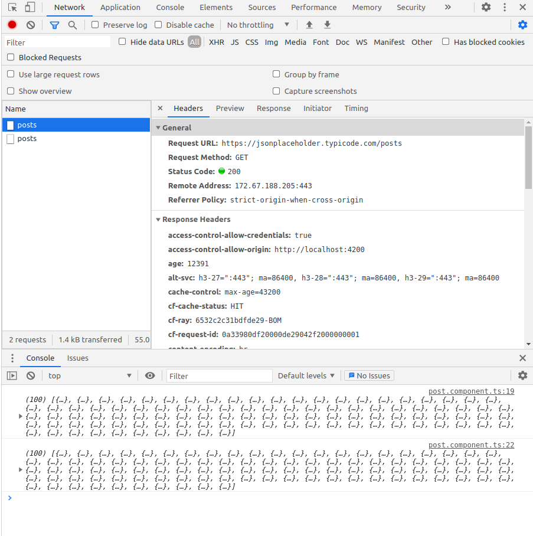

### 1.4 How To Add Parameter

Set parameter to request using `set()` : 
```js
  getPostByIdParam(id: number) {
    let params = new HttpParams().set('id', id.toString());
    return this.http.get<Post>(`${this.jsonPlaceholder}/posts`, { params: params });
  }
```
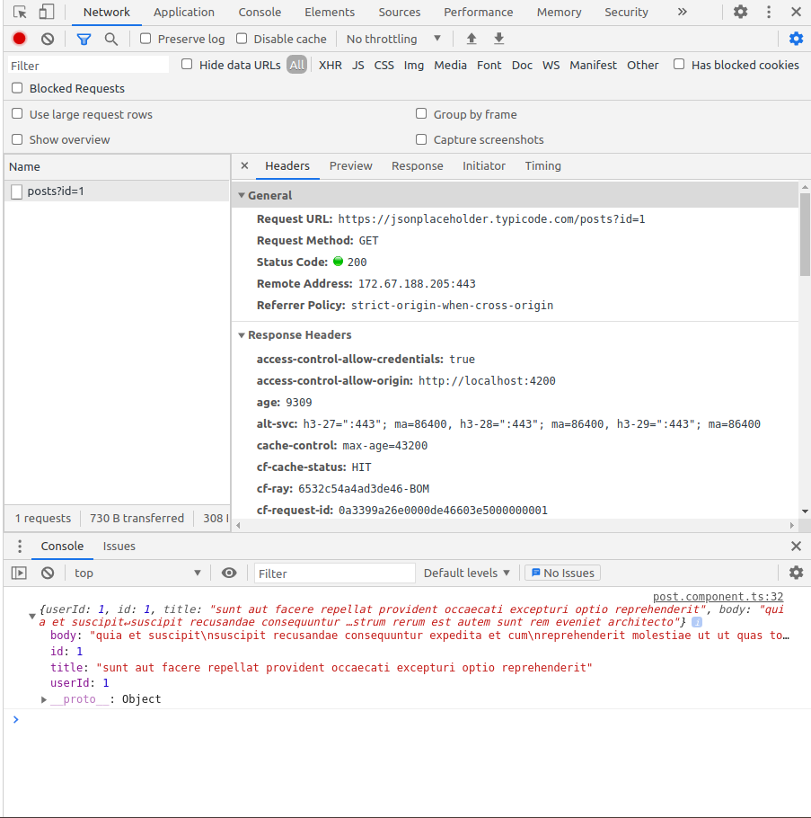

Append parameters to request using `append()` :
```js
  getPostByMultipleParam() {
    let params = new HttpParams();
    params = params.append('id', '1');
    params = params.append('page', '2');
    return this.http.get<Post>(`${this.jsonPlaceholder}/posts`, { params: params });
  }
```

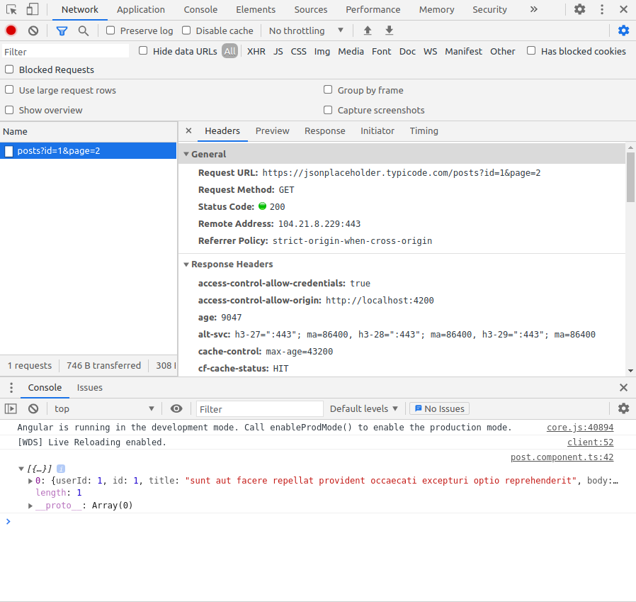

### 1.5 How To Use Path Variable
Add path-variable dynamically using syntax `${ }` :

```js
 getPostByIdPathVariable(id: number) {
    return this.http.get<Post>(`${this.jsonPlaceholder}/posts/${id}`);
  }
```
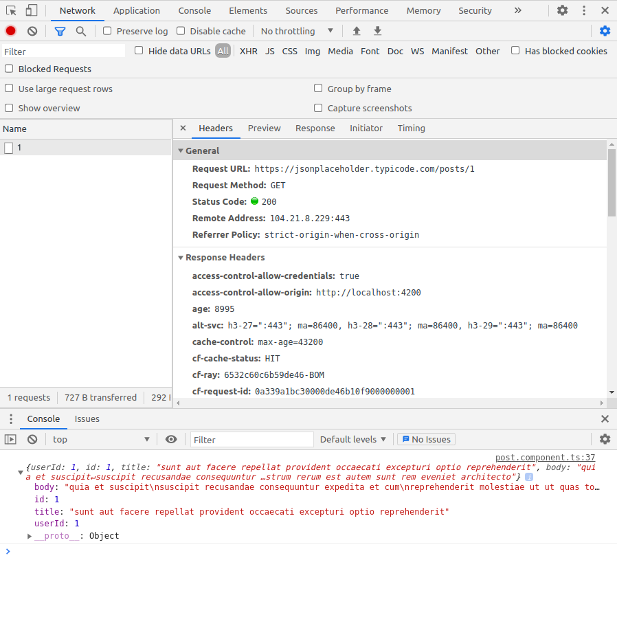

### 1.6 HTTP POST

The HttpClient.post() sends the HTTP POST request to the endpoint. Similar to the get().In our example, we using the post method to create a new post 

```js
  createNewPost() {
    const newPost = {
      body: 'Craeted new post',
      title: 'Santino D\'Antonio',
      userId: 12
    }
    return this.http.post(`${this.jsonPlaceholder}/posts`, newPost);
  }
```
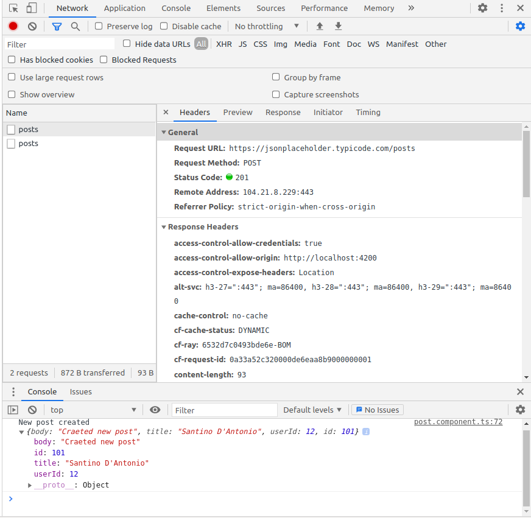

### 1.7 HTTP PUT

For editing a record, we will use the put method on the HTTP Client object. It is very similar to post except that we are editing a pre-existing record.

```js
 updatePost() {
     // wihtout type response
    const post = {
      body: 'Changed post body',
      title: 'Changed post title'
    }
    return this.http.put(`${this.jsonPlaceholder}/posts/1`, post);
  }

  updatePostWithType(): Observable<Post> {
  // with typed response
    const post = {
      body: 'Changed post body',
      title: 'Changed post title'
    }
    return this.http.put<Post>(`${this.jsonPlaceholder}/posts/1`, post);
  }
```
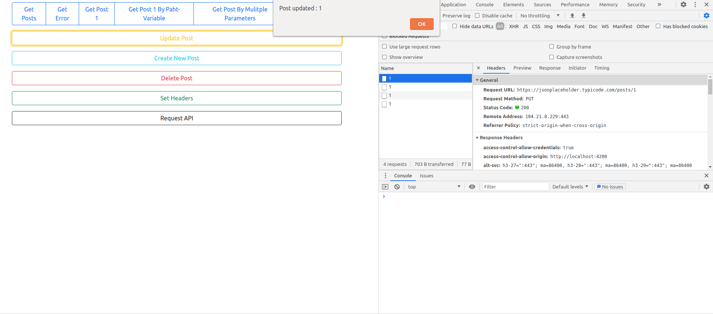


### 1.8 HTTP DELETE

Let's see an example of how we can send an HTTP DELETE request to delete a resource from the API server using the `delete()` method provided by the HttpClient.

```js
  deletePost() {
    return this.http.delete(`${this.jsonPlaceholder}/posts/1`);
  }
```

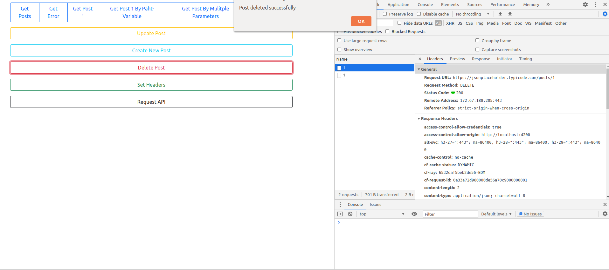

### 1.9 Error Handling

By using Angular's HttpClient along with catchError from RxJS, we can easily write a function to handle errors within each service.For Client-side errors HttpCliet returns ErrorEvent instances and for Server-side error it returns HTTP Error Responses.We have implemented error handling as below : 

```js
 handleError(error: HttpErrorResponse) {
    let errorMessage = 'Unknown error!';
    if (error.error instanceof ErrorEvent) {
      // Client-side errors
      errorMessage = `Error: ${error.error.message}`;
    } else {
      // Server-side errors
      errorMessage = `Error Code: ${error.status}\nMessage: ${error.message}`;
    }
    window.alert(errorMessage);
    return throwError(errorMessage);
  }
```

And we can use this function to handle error poroduced by any HttpClient API by using rxjs operator `pipe()` like,

```js
 getPostsError() {
    return this.http.get<Post[]>(`${this.jsonPlaceholder}//posts`).pipe(catchError(this.handleError));
  }
```

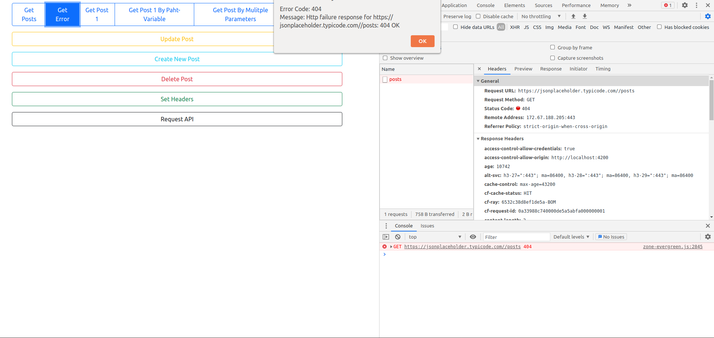

### 2 Change Response Type
HttpClient object allows accessing complete response using `observe`, including headers. In the browser, the response body is a JSON object, which can be copied to a typescript interface or class type.\
Observe has three kinds of option 
- body which is the default option 
- response to get full response including body,header,status code,status text,etc.
- events is to access individual events or steps while making a HTTP call

Response headers are key/value pairs. Consider the following code that accesses the complete response object.

```js
 getFullResponse() {
    // observer has three options  'body' | 'response' | 'events'
    return this.http.get<Post>(`${this.jsonPlaceholder}/posts/1`, { observe: 'response' });
  }
```
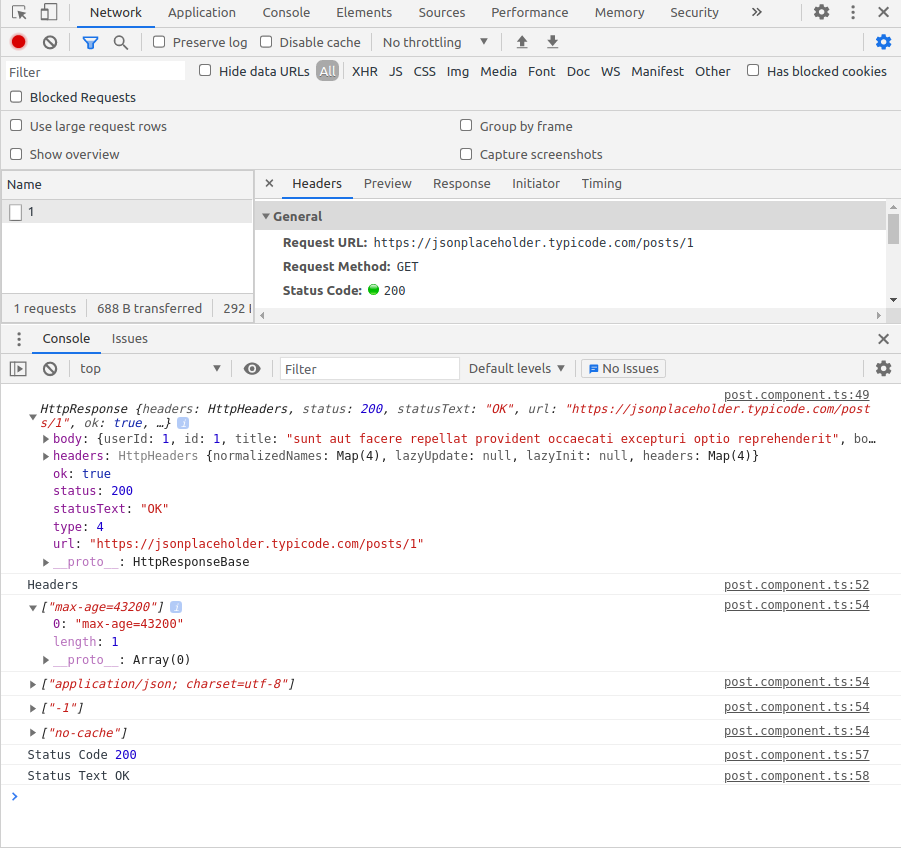

Oserver is set to events 
```js
getResponseByEvents() {
    return this.http.get<Post>(`${this.jsonPlaceholder}/posts/1`, { observe: 'events' });
  }
```


### 2.2 Modify Headers

The `headers` option of every HttpClient allows you to add HTTP headers to the outgoing requests. 

```js
  setHeaders() {
    let headers = new HttpHeaders().set('Content-Type', 'application/text');
    if (!headers.has('authentication')) {
      headers = headers.append('authentication', `AKYOPVvew32BU5w1543qqOrsNSP`);
    }
    return this.http.get(`${this.jsonPlaceholder}/posts/2`, { headers: headers });
  }
```
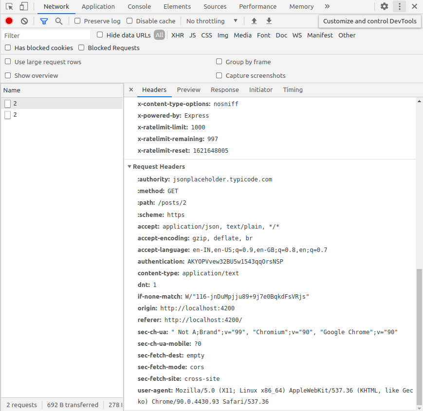


### 2.3 HTTP requseAPI
One of the generic API that HttpClient provides is the `request()` API, we can use request API to perform HTTP operations from GET, PUT, POST, and DELETE.Example for that

```js
  requseAPI() {
      // also support PUT,POST,DELETE
      return this.http.request("GET", `${this.jsonPlaceholder}/posts`, 
                                          { responseType: 'json', params: { 'id': '1' } });
    }
  }
```
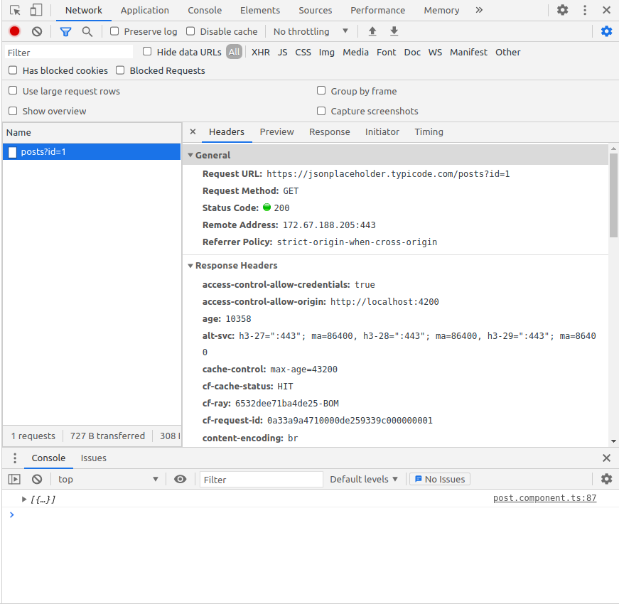


