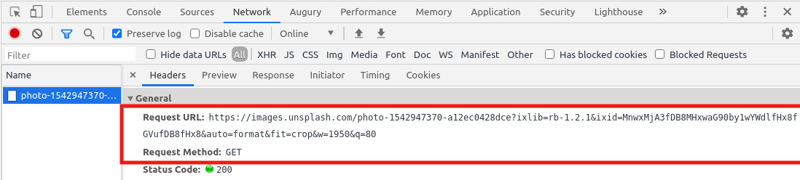
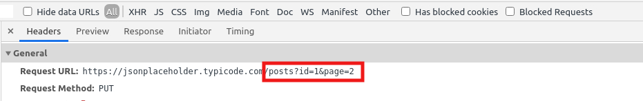
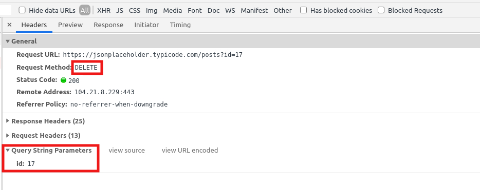
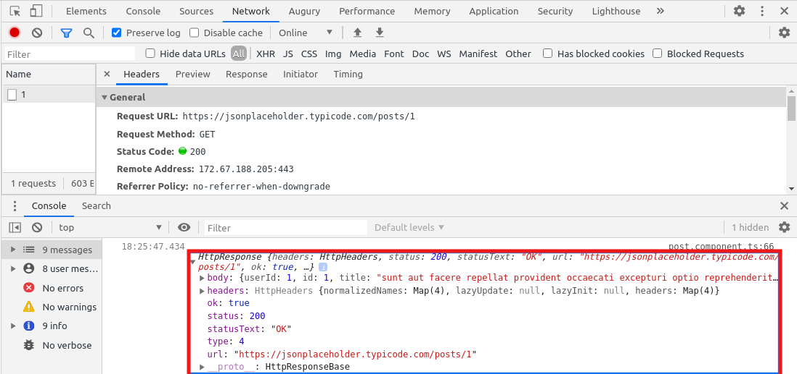

# Http Requests Example


Angular provides a client HTTP API for Angular applications, the HttpClient service class in `@angular/common/HTTP.


Before you can use HttpClient, you need to import the Angular `HttpClientModule` 

## 1 Topics Covered

- What is **Angular HttpClient**?
- How to use HttpClient?
- HTTP GET
- HTTP POST
- HTTP PUT
- HTTP DELETE
- Error Handling
- Change Response Type
- HTTP requseAPI
- Extra Dependency

### 2 What is **Angular HttpClient**?

The HttpClient builtin service provides many advantages to Angular developers:

- The HTTP client service offers the following major features.
  - The ability to request typed response objects.
  - Streamlined error handling.
  - Testability features.
  - Request and response interception.

- HttpClient makes it easy to send and process HTTP requests and responses,
- HttpClient has many builtin features for implementing test units,
- HttpClient makes use of RxJS Observables for handling asynchronous operations instead of Promises which simplify common web development tasks such as
  - The concelation of HTTP requests,
  - Listening for the progression of file download and file upload operations,
  - Easy error handling,
  - Retrying failed HTTP requests, etc.

### 3 How to use HttpClient?

- Import **HttpClientModule** in to `app.module.ts` after BrowserModule

```js
import { HttpClientModule } from '@angular/common/http';

@NgModule({
  imports: [
    BrowserModule,
    HttpClientModule
  ]
})
export class AppModule { }
```
- Import Required Module in Service (post.serivce.ts)
```js
  import { HttpClient } from '@angular/common/http';
````
- Inject the HttpClient service in the constructor in that service (post.service.ts)
```js
constructor(public http: HttpClient) { }
```
Now, we are ready to use **HttpClient**

- In this application we are going to use **'jsonplaceholder'** as backend server to perform some REST API call
  - For that we have set jsonplaceholder base url in the environment profile (environment.ts) :
  ```js
    export const environment = {
      production: false,
      jsonPlaceholder : 'https://jsonplaceholder.typicode.com'
    };
  ```
  - And used that base url into our Post Service :
  ```js
    jsonPlaceholder: string;

    constructor(private http: HttpClient) {
      this.jsonPlaceholder = environment.jsonPlaceholder;   // https://jsonplaceholder.typicode.com
    }
  ```
 - Also we have created extra function to create HttpHeaders :
 ```js
    createHeaders() {
      let headers = new HttpHeaders().set('Content-Type', 'application/text');     // To set header
      if (!headers.has('authentication')) {    // TO check if header exists
        headers = headers.append('authentication', `AKYOPVvew32BU5w1543qqOrsNSP`);   // To append header to another headers
      }
      return headers;
    }
 ```

### 4 HTTP GET

#### 4.1  Simple GET Request :
The `get()` method of HttpClient to send **GET** requests to the REST API server. By default, the body of any HTTP method's response is parsed as JSON. If you want any other type, then you need to specify explicitly using the **' observe & responseType '** options.
Example of GET as given below : 

```js
  getPosts() {
    //without typed response
    return this.http.get(`${this.jsonPlaceholderBaseUrl}/posts`)
      .subscribe(posts => console.log(posts));
  }
```
#### 4.2 And for Typed response : 

```js
  getPostsWthTypedResponse() {
    // typed http response(Post[])
    return this.http.get<Post[]>(`${this.jsonPlaceholderBaseUrl}/posts`)
      .subscribe(posts => console.log(posts));
  }
```


#### 4.3 Add parameter To GET Request :

```js
  getPostByIdParam(id: number) {
    let params = new HttpParams().set('id', id.toString());
    return this.http.get<Post>(`${this.jsonPlaceholderBaseUrl}/posts`, { params: params })
      .subscribe(post => console.log(post[0]));
  }
```


#### 4.4 Add Multiple Parameters To GET Request :

```js
  getPostByMultipleParam() {
    let params = new HttpParams();
    params = params.append('id', '1');
    params = params.append('page', '2');
    return this.http.get<Post>(`${this.jsonPlaceholderBaseUrl}/posts`, { params: params })
      .subscribe(post => console.log(post));
  }
```


#### 4.4 Add Path Variable To GET Request :

```js
  getPostByIdPathVariable(id: number) {
    return this.http.get<Post>(`${this.jsonPlaceholderBaseUrl}/posts/${id}`)
    .subscribe(post => console.log(post));
  }
```


#### 4.5 Download File Using GET Request : 

To get a file from API we need to change responseType and to create a file and open it in new window :  

```js
 downloadFile() {
    return this.http.get(this.exampleImageUrl, { responseType: 'blob' }).subscribe(
      fileData => {

        //  To open file in new  window
        // let blob: any = new Blob([fileData], { type: 'image/*' });
        // const url = window.URL.createObjectURL(blob);
        // window.open(url);
      }
    );
  }
```
 
To download File : 

```js
  downloadFile() {
    return this.http.get(this.exampleImageUrl, { responseType: 'blob' }).subscribe(
      fileData => {

        // To save file 
        FileSaver.saveAs(fileData, 'employees.jpg');
      }
    );
  }
```


#### 4.6 Set Header To GET Request :

```js
  setHeaderToGet() {
    return this.http.get(`${this.jsonPlaceholderBaseUrl}/posts/2`,
      { headers: this.createHeaders() })
      .subscribe(post => console.log(post));
  }
```


### 5 HTTP POST

#### 5.1 Simple POST Requset :
The HttpClient.post() sends the HTTP POST request to the endpoint. Similar to the get().In our example, we using the post method to create a new post 

```js
   createNewPost() {
    const newPost = {
      body: 'Craeted new post',
      title: 'Santino D\'Antonio',
      userId: 12
    };
    return this.http.post(`${this.jsonPlaceholderBaseUrl}/posts`, newPost).
      subscribe(newPostId => console.log('New post created', newPostId));
  }
```


#### 5.2 Add parameter To POST Request :

```js
  createPostWithParamters() {
    const newPost = {
      body: 'Craeted new post with pararms',
      title: 'John Wick',
      userId: 8
    };
    let params = new HttpParams().set('userId', '85');
    params = params.append('comment', 'Not to Focus');
    return this.http.post(`${this.jsonPlaceholderBaseUrl}/posts`, newPost,
      { params: params })
      .subscribe(newPostId => console.log('New post created', newPostId));
  }
```


#### 5.3 UploadFile File using POST Request :

`Formdata` is used to upload file using REST API
```js
  uploadFile(fileInput) {
    const formData = new FormData();
    formData.append('files', fileInput.target.files[0]);
    return this.http.post(this.uploadFileUrl, formData).subscribe(res => {
      console.log(res);
      alert('File is uploaded');
    });
  }
```


#### 5.4 Pass Formdata using POST Request : 
```js
  passFormData(fileInput) {
    const formData: FormData = new FormData();
    formData.append('email', 'dummy@mail.com');
    formData.append('password', 'notanissue');
    return this.http.post(this.uploadFileUrl, formData).subscribe(res => {
      console.log(res);
      alert('Form data is passed');
    });
  }
```


#### 5.5 Set header To POST Request : 

```js
  setHeaderToPost() {
    const newPost = {
      body: 'Craeted new post',
      title: 'Santino D\'Antonio',
      userId: 12
    };
    return this.http.post(`${this.jsonPlaceholderBaseUrl}/posts`, newPost,
      { headers: this.createHeaders() })
      .subscribe(post => console.log(post));
  }
```


### 6 HTTP PUT

#### 6.1 Simple PUT Request : 
For editing a record, we will use the put method on the HTTP Client object. It is very similar to the post except that we are editing a pre-existing record.

```js
  updatePost() {
  // without typed response
    const post = {
      body: 'Changed post body',
      title: 'Changed post title'
    };
    return this.http.put(`${this.jsonPlaceholderBaseUrl}/posts`, post)
      .subscribe(updatedPost => window.alert(`Post updated : ${updatedPost['id']}`));
  }

  updatePostWithType() {
  // with typed reponse 'Post'
    const post = {
      body: 'Changed post body',
      title: 'Changed post title'
    };
    return this.http.put<Post>(`${this.jsonPlaceholderBaseUrl}/posts/1`, post)
      .subscribe(updatedPost => window.alert(`Post updated : ${updatedPost.id}`));
  }
```


#### 6.2 Add parameter To PUT Request :
```js
  updatePostByParameter() {
    const post = {
      body: 'Changed post body',
      title: 'Changed post title'
    };
    let params = new HttpParams();
    params = params.append('id', '1');
    params = params.append('page', '2');
    return this.http.put(`${this.jsonPlaceholderBaseUrl}/posts`, post,
      { params: params }).
      subscribe(updatedPost => window.alert(`Post updated : ${updatedPost}`));
  }
```
 

 
#### 6.3 Set Header to PUT Request : 
```js
  setHeaderToPut() {
    const post = {
      body: 'Changed post body',
      title: 'Changed post title'
    };
    return this.http.put(`${this.jsonPlaceholderBaseUrl}/posts/1`, post,
      { headers: this.createHeaders() })
      .subscribe(post => console.log(post));
  }
```


### 7 HTTP DELETE

#### 7.1 Simple DELETE Request :

Let's see an example of how we can send an HTTP DELETE request to delete a resource from the API server using the `delete()` method provided by the HttpClient.

```js
  deletePost() {
    return this.http.delete(`${this.jsonPlaceholderBaseUrl}/posts/1`)
      .subscribe(() => window.alert('Post deleted successfully'));
  }
```


#### 7.2 Add parameter To DELETE Request :
```js
  deletePostWithParameter() {
    let params = new HttpParams().set('id', '17');
    return this.http.delete(`${this.jsonPlaceholderBaseUrl}/posts`,
      { params: params })
      .subscribe(() => window.alert('Post deleted successfully'));
  }
```



#### 7.3 Set Header To DELETE Request : 
```js
  setHeaderToDelete() {
    return this.http.delete(`${this.jsonPlaceholderBaseUrl}/posts/1`,
      { headers: this.createHeaders() })
      .subscribe(post => console.log(post));
  }
```


### 8 Error Handling

By using Angular's HttpClient along with catchError from RxJS, we can easily write a function to handle errors within each service.For Client-side errors HttpCliet returns ErrorEvent instances and for Server-side error it returns HTTP Error Responses.We have implemented error handling as below : 

```js
  handleError(error: HttpErrorResponse) {
    let errorMessage = 'Unknown error!';
    if (error.error instanceof ErrorEvent) {
      // Client-side errors
      errorMessage = `Error: ${error.error.message}`;
    } else {
      // Server-side errors
      errorMessage = `Error Code: ${error.status}\nMessage: ${error.message}`;
    }
    window.alert(errorMessage);
    return throwError(errorMessage);
  }
```

And we can use this function to handle error poroduced by any HttpClient API by using rxjs operator `pipe()` like,

```js
  handleErrors() {
    return this.http.get<Post[]>(`${this.jsonPlaceholderBaseUrl}//posts`)
      .pipe(catchError(this.handleError))
      .subscribe(data => console.log(data), error => console.log(error));
  }
```


### 9 Change Response Type
HttpClient object allows accessing complete response using `observe`, including headers. In the browser, the response body is a JSON object, which can be copied to a typescript interface or class type.\
Observe has three kinds of option 
- body which is the default option 
- response to get full response including body,header,status code,status text,etc.
- events is to access individual events or steps while making an HTTP call

Response headers are key/value pairs. Consider the following code that accesses the complete response object.

```js
  getFullResponse() {
    // observer has three options  'body' | 'response' | 'events'
    return this.http.get<Post>(`${this.jsonPlaceholderBaseUrl}/posts/1`, { observe: 'response' }).subscribe(response => {
      // Full resopnse
      console.log(response);

      //headers
      console.log('Headers');
      const headersKey: string[] = response.headers.keys();
      headersKey.forEach(key => console.log(response.headers.getAll(key)));

      //status 
      console.log('Status Code', response.status);
      console.log('Status Text', response.statusText);
    });
  }
```


Oserver is set to events 
```js
  getResponseByEvents() {
    return this.http.get<Post>(`${this.jsonPlaceholderBaseUrl}/posts/1`, { observe: 'events' }).subscribe((result) => {
      if (result.type === HttpEventType.Sent) {
        console.log("request sent");
      } else if (result.type === HttpEventType.Response) {
        console.log("response obtained");
      }
    });
  }
```


### 10 HTTP requseAPI

One of the generic API that HttpClient provides is the `request()` API, we can use request API to perform HTTP operations from GET, PUT, POST, and DELETE. Example for that

```js
  requseAPI() {
    // also support PUT,POST,DELETE
    return this.http.request("GET", `${this.jsonPlaceholderBaseUrl}/posts`,
      { responseType: 'json', params: { 'id': '1' } })
      .subscribe(post => console.log(post));
  }
```


### 11 Extra Dependency 

>   "file-saver": "^2.0.5"

- Dev Dependency :
>  "@types/file-saver": "^2.0.2"


